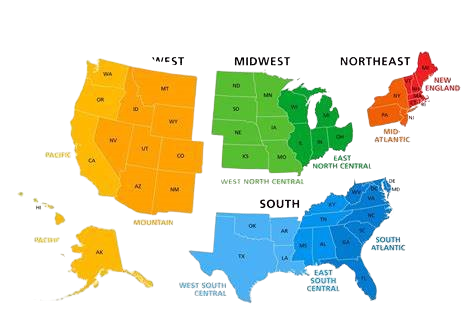
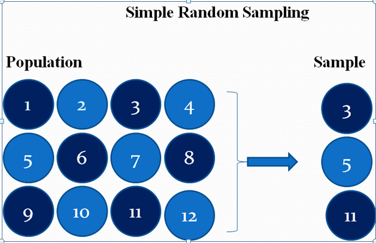
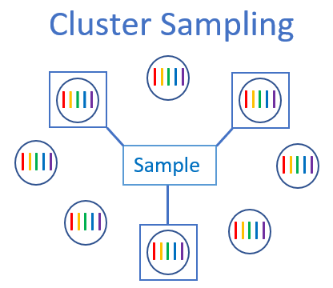

```{r setup, include=FALSE}
options(htmltools.dir.version = FALSE)
knitr::opts_chunk$set(
  fig.width=9, fig.height=3.5, fig.retina=3,
  out.width = "100%",
  cache = FALSE,
  echo = FALSE,
  message = FALSE, 
  warning = FALSE,
  hiline = TRUE
)
```

```{r xaringan-themer, include=FALSE, warning=FALSE}
library(xaringanthemer)

style_mono_light(
  header_font_google = google_font("Open Sans", "300"),
  text_font_google   = google_font("Lato", "400"),
  code_font_google   = google_font("IBM Plex Mono"),
  base_color = "#2c5a6c")

```


<h1 align = "center"> Table of Contents </h1>
<center><font size="7">  
- Introduction <br>
- Exploratory Data Analysis <br>
- Sampling Process and Default Rates<br>
   - Simple Random <br>
   - Systematic <br>
   - Stratified <br>
   - Cluster <br>
- Visualizations<br>
- Conclusion & Discussion
</font></center>

---
name: colors

## Introduction
<font size="5">
- Bank Loan dataset

- just under 900,000 observations

- Population: loan applications submitted to banks by small businesses with a partial warranty from the Small Business Association

- Four different samples of about 4,000 observations taken using four different sampling methods
    - SRS
    - Systematic
    - Stratified
    - Cluster
    
- Observations divided into regions for analysis & sampling purposes

- Regional loan default rates compared among different sampling methods

- Response: MIS_Status (Loan paid off or defaulted)

---
name: colors

## Exploratory Data Analysis

<font size="5">
.pull-left[
- Data split up into nine subsets, combined back into one master data set
- Observation with missing values for loan status variable removed from analytic data set
- Data stratified by newly created Region variable (Northeast, Midwest, South, West), based on borrower's state 
- List of all unique ZIP codes generated, split into clusters for sampling purposes later in analysis 
- Study population: observations from original population which had some loan status listed and which fell into one of the four U.S. geographic regions defined by Region variable (896,872 total observations)

```{r dataset}
# Read in the dataset
loan01 = read.csv("https://pengdsci.github.io/datasets/SBAloan/w06-SBAnational01.csv", header = TRUE)[, -1]
loan02 = read.csv("https://pengdsci.github.io/datasets/SBAloan/w06-SBAnational02.csv", header = TRUE)[, -1]
loan03 = read.csv("https://pengdsci.github.io/datasets/SBAloan/w06-SBAnational03.csv", header = TRUE)[, -1]
loan04 = read.csv("https://pengdsci.github.io/datasets/SBAloan/w06-SBAnational04.csv", header = TRUE)[, -1]
loan05 = read.csv("https://pengdsci.github.io/datasets/SBAloan/w06-SBAnational05.csv", header = TRUE)[, -1]
loan06 = read.csv("https://pengdsci.github.io/datasets/SBAloan/w06-SBAnational06.csv", header = TRUE)[, -1]
loan07 = read.csv("https://pengdsci.github.io/datasets/SBAloan/w06-SBAnational07.csv", header = TRUE)[, -1]
loan08 = read.csv("https://pengdsci.github.io/datasets/SBAloan/w06-SBAnational08.csv", header = TRUE)[, -1]
loan09 = read.csv("https://pengdsci.github.io/datasets/SBAloan/w06-SBAnational09.csv", header = TRUE)[, -1]
loan = rbind(loan01, loan02, loan03, loan04, loan05, loan06, loan07, loan08, loan09)
# dim(bankLoan)
#names(bankLoan)
```


```{r}
loan <- subset(loan, !MIS_Status == "")
study.pop <- subset(loan, !Zip == "0")
```


```{r}
library(tidyverse)
study.pop <- study.pop %>%
  mutate(Region = case_when(
    State %in% c("ME", "VT", "NH", "MA", "RI", "CT", "NY", "NJ", "PA") ~ "Northeast",
    State %in% c("WI", "MI", "IL", "IN", "OH", "ND", "SD", "NE", "KS", "MN", "IA", "MO") ~ "Midwest",
    State %in% c("DE", "MD", "DC", "VA", "WV", "NC", "SC", "GA", "FL", "KY", "TN", "AL", "MS", "AR", "LA", "OK", "TX") ~ "South",
    State %in% c("WA", "OR", "CA", "NV", "ID", "MT", "WY", "CO", "UT", "AZ", "NM", "AK", "HI") ~ "West",
    TRUE ~ "Other"
  ))

study.pop <- subset(study.pop, !Region == "Other")
```


```{r}
unique.zipcodes <- unique(study.pop$Zip)
zip.clusters <- split(study.pop, study.pop$Zip)

```
]

.pull-right[
```{r, echo=FALSE}

```
]            


---
class: inverse center middle

# Sampling Methods

---
name: colors

## Simple Random Sampling

.pull-left[

- 4,000 observations (target sample size for analysis) chosen at random across entire sampling frame

- Regional default rate = (# of observations from subgroup in sample)/(amount of those observations for which **MIS_Status** = "CHGOFF")
  - Expressed as a percentage


```{r}
set.seed(123)
study.pop$sampling.frame = 1:length(study.pop$GrAppv)   
sampled.list = sample(1:length(study.pop$GrAppv), 4000) 
SRS.sample = study.pop[sampled.list,] 
```

```{r, echo=FALSE, out.width="550px", out.height="275px"}

```
]

.pull-right[


```{r, fig.width=8, fig.height=12}
region.default.SRS <- SRS.sample %>%
  group_by(Region) %>%
  summarize(default_rate = mean(MIS_Status == 'CHGOFF')*100)
library(kableExtra)
kable(region.default.SRS, caption = "Regional Default Rates (SRS)")
```
]

---
name: colors

## Systematic Random Sampling

.pull-left[

- First observation selected at random, then every *i*-th subsequent observation selected where *i* is chosen jump size
- Jump size determined by dividing number of observations in sampling frame by target sample size
- 4,004 observations selected, 4 removed at random to achieve target sample size of 4,000

```{r}
set.seed(123)
jump.size = dim(study.pop)[1]%/%4000  
rand.starting.pt=sample(1:jump.size,1)
sampling.id = seq(rand.starting.pt, dim(study.pop)[1], jump.size)
sys.sample=study.pop[sampling.id,]    
set.seed(123)
extra.obs <- sample(nrow(sys.sample), 4)
sys.sample.final <- sys.sample[-extra.obs, ]
```

```{r, echo=FALSE, out.width="550px", out.height="300px"}
knitr::include_graphics("systematic_vis.png")
```
]

.pull-right[
```{r}
region.default.sys <- sys.sample.final %>%
  group_by(Region) %>%
  summarize(default_rate = mean(MIS_Status == 'CHGOFF')*100)
kable(region.default.sys, caption = "Regional Default Rates (Systematic)")
```
]
---
name: colors 

## Stratified Random Sampling

.pull-left[

- Study population stratified into four subpopulations based on **Region** variable
- About 4,000 observations selected by taking random sample from each stratum, maintaining the proportions of each of the subpopulations to the entire study population
- Subpopulation samples combined to create stratified sample (3,999 total observations) 

```{r}
freq.table = table(study.pop$Region)  
rel.freq = freq.table/sum(freq.table)    
strata.size = round(rel.freq*4000)      
strata.names=names(strata.size)

set.seed(123)
strata.sample = study.pop[1,]
strata.sample$add.id = 1
for (i in 1:length(strata.names)){
   ith.strata.names = strata.names[i]
   ith.strata.size = strata.size[i]
   ith.sampling.id = which(study.pop$Region==ith.strata.names) 
   ith.strata = study.pop[ith.sampling.id,]
   ith.strata$add.id = 1:dim(ith.strata)[1] 
   ith.sampling.id = sample(1:dim(ith.strata)[1], ith.strata.size) 
   ith.sample =ith.strata[ith.strata$add.id %in%ith.sampling.id,]
   strata.sample = rbind(strata.sample, ith.sample)
 }
strat.sample.final = strata.sample[-1,]
```

```{r, echo=FALSE, out.width="550px", out.height="300px"}
knitr::include_graphics("stratified_sys.png")
```

]

.pull-right[
```{r}
region.default.strat <- strat.sample.final %>%
  group_by(Region) %>%
  summarize(default_rate = mean(MIS_Status == 'CHGOFF')*100)

kable(region.default.strat, caption = "Regional Default Rates (Stratified)")
```
]

---
name: colors

## Cluster Sampling


.pull-left[

- Random sample taken from list of unique ZIP codes created in EDA phase
- All "clusters" of observations which fell into any of the randomly selected ZIP codes combined to form cluster sample
- 450 clusters (i.e., sampled ZIP codes) randomly selected to obtain a sample close to the target sample size (3,971 total observations)


```{r}
set.seed(123)
sampled_clusters <- sample(unique.zipcodes, size = 450)
cluster.sample <- do.call(rbind, zip.clusters[sampled_clusters])
```

```{r, echo=FALSE, out.width="550px", out.height="300px"}

```

]
.pull-right[
```{r}
region.default.cluster <- cluster.sample %>%
  group_by(Region) %>%
  summarize(default_rate = mean(MIS_Status == 'CHGOFF')*100)
kable(region.default.cluster, caption = "Regional Default Rates (Cluster)")

```
]

---
name: colors

## Cluster Sampling


```{r}
## merge latitude and longitutde data with zip code cluster
lat.long <- read.csv("uszips.csv", header=TRUE, sep=",")

zip.map <- merge(cluster.sample, lat.long, by.x = 'Zip',by.y='zip', all.x=TRUE)

## count number of each zip code for color and size in plot
zip.color <- zip.map %>% 
  group_by(Zip) %>% 
  summarize(cnt=n())

#merge with dataset
zip.map1 <- merge(zip.map, zip.color, by = "Zip", all.x=TRUE)
```


```{r, echo=FALSE,  out.height='550px'}

library(plotly)
# geo styling
g <- list(      scope = 'usa',
           projection = list(type = 'albers usa'),
             showland = TRUE,
            landcolor = toRGB("gray95"),
         subunitcolor = toRGB("gray85"),
         countrycolor = toRGB("gray85"),
         countrywidth = 0.5,
         subunitwidth = 0.5
       )
###
fig <- plot_geo(zip.map1, lat = ~lat, lon = ~lng) %>% 
  add_markers( text = ~paste(City, State, 
                             paste("Count:", cnt), 
                             sep = "<br>"),
              color = ~cnt, 
              symbol = "circle", 
              size = ~cnt, 
              hoverinfo = "text")   %>% 
  colorbar(title = "# of Zip Codes")  %>% 
  layout( title = 'Zip Codes', 
          geo = g )

fig

```

---
name: colors

## Population Default Rates

- Default rates calculated for each region based on the entire study population

- Can be used to compare with sample estimates

```{r}
region.default.pop <- study.pop %>%
  group_by(Region) %>%
  summarize(default_rate = mean(MIS_Status == 'CHGOFF')*100)
kable(region.default.pop, caption = "Regional Default Rates (Population)")
```


---
class: inverse center middle

# Visualizations

---
name: middle

## Default Rates

```{r}
SRS.total.rates = cbind(region.default.pop, region.default.SRS, region.default.sys, region.default.strat, region.default.cluster)
SRS.total.rates <- data.frame(SRS.total.rates)
SRS.total.rates <- select(SRS.total.rates, Region, default_rate, default_rate.1,default_rate.2,default_rate.3,default_rate.4)
colnames(SRS.total.rates) <- c("Region", "Population","SRS","Systematic","Stratified","Cluster")
kable(SRS.total.rates, caption="Comparison of Regional Default Rates 
                               Among Population & Different Samples")
```


---
name: colors

## Bar Charts

- South consistently exhibited highest default rate across all sampling groups, order of other three regions depended on sample

- Similar variation in calculated default rate across sampling groups for each region  

```{r}
combined_df <- rbind(region.default.SRS, region.default.sys, region.default.strat, region.default.cluster, region.default.pop)
combined_df$Sample <- rep(c("SRS", "Systematic", "Stratified", "Cluster", "Population"), each = nrow(region.default.SRS))
combined_df$Sample <- factor(combined_df$Sample, levels = c("SRS", "Systematic", "Stratified", "Cluster", "Population"))

# Create the bar chart
my_colors <- c("SRS" = "seagreen3", "Systematic" = "royalblue2", "Stratified" = "purple", "Cluster" = "lightgoldenrod2", "Population" = "slategray")
library(ggplot2)
combined_plot1 <- ggplot(combined_df, aes(x = Region, y = default_rate, fill = Sample)) +
  geom_bar(stat = "identity", position = "dodge") + 
  labs(title = "Comparison of Regional Default Rates (Grouped by Region)",
       x = "Region",
       y = "Default Rate",
       fill = "Sample") +
       ylim(0, 25) + scale_fill_manual(values = my_colors)
#+    theme(plot.background = element_rect(fill = "#cad3da", color = "#cad3da"))                    # Change plot background
  


combined_plot1
```
---
name: colors

## Bar Charts

- Beyond the South having the highest default rate, there are considerable differences in the suggestions of each sample.
  - E.g., SRS suggests Midwest has 2nd highest default rate (around 17.5%), while according to the stratified sample it actually has the lowest (under 15%).
- Overall, the regional default rates from the systematic sample bear the closest resemblance to those of the study population. 

```{r}
my_colors2 <- c("Northeast" = "seagreen3", "Midwest" = "royalblue2", "South" = "purple", "West" = "lightgoldenrod2")
combined_plot2 <- ggplot(combined_df, aes(x = Sample, y = default_rate, fill = Region)) +
  geom_bar(stat = "identity", position = "dodge") + 
  labs(title = "Comparison of Regional Default Rates (Grouped by Sample/Population)",
       x = "Sample",
       y = "Default Rate",
       fill = "Region") +
       ylim(0, 25) + scale_fill_manual(values = my_colors2)

combined_plot2
```
---
class: inverse center middle

# Conclusion

---
name: colors

## Conclusion

<font size="5.5">
- Systematic sample recommended based on closest resemblance of regional default rates to those of the population
  - Not entirely representative (e.g., estimates for South & West are noticeably higher than population figures

- Not necessarily an optimal sample, may be advisable to try alternative sampling methods, sample sizes, stratification variables, etc. to generate a more representative sample

---
class: inverse center middle

# Questions?


---
class: colors

## Contributions

- Content ~ Haley
- Slide Style ~ Gianna
- Edit Content/Slides ~ Haley, Gianna